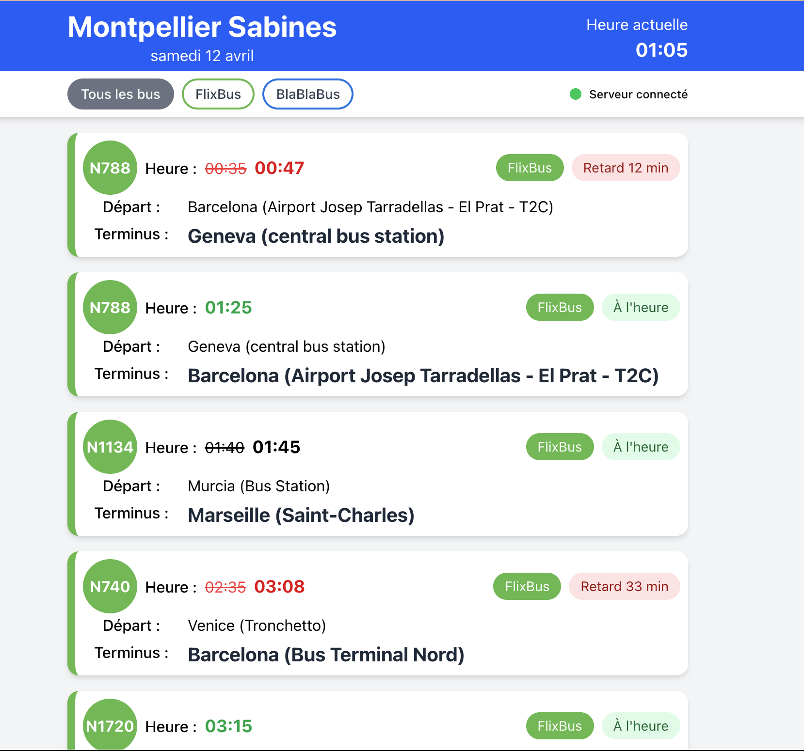

# Application Horaires de Bus - Frontend

Interface utilisateur pour consulter les horaires de bus FlixBus et BlaBlaBus à la gare routière de Montpellier Sabines.




## Fonctionnalités

- 🚌 Affichage des horaires de bus en temps réel
- 🔄 Mise à jour automatique des données
- 🏢 Filtrage par compagnie (FlixBus, BlaBlaBus ou tous)
- 🚦 Indication de l'état du serveur (connecté, déconnecté, chargement)
- 📱 Interface responsive adaptée aux mobiles et ordinateurs
- ⌚ Affichage du statut des bus (à l'heure, en retard)
- 🔍 Détails des arrêts pour chaque bus

## Technologies utilisées

- React.js
- TypeScript
- Tailwind CSS
- React Hooks (useState, useEffect, useRef, useTransition)


## Structure du projet

```
src/
├── actions/            # Fonctions d'appel API et traitement des données
│   ├── busActions.js      # Récupération et formatage des données de bus
│   └── serverStateActions.js   # Vérification de l'état du serveur
├── components/         # Composants UI réutilisables
│   ├── BusCard/            # Carte affichant les informations d'un bus
│   ├── CompanyFilter/      # Filtre pour sélectionner les compagnies
│   ├── Header/             # En-tête avec l'heure actuelle
│   ├── LoadingSpinner/     # Indicateur de chargement
│   └── ServerStatus/       # Indicateur d'état du serveur
├── helpers/            # Fonctions utilitaires
│   ├── constants.js        # Constantes de l'application
│   └── utils.js            # Fonctions utilitaires (formatage de dates, etc.)
├── types.ts            # Définitions TypeScript
├── App.tsx             # Composant principal
├── App.css             # Styles CSS spécifiques à l'application
└── index.tsx           # Point d'entrée
```

## Utilisation

### Chargement initial

Au démarrage, l'application charge automatiquement les horaires de bus depuis le backend. Un spinner de chargement s'affiche pendant ce temps.

### Filtrage par compagnie

Utilisez les boutons en haut de l'écran pour filtrer les bus par compagnie :
- "Toutes" : affiche tous les bus
- "FlixBus" : affiche uniquement les bus FlixBus
- "BlaBlaBus" : affiche uniquement les bus BlaBlaBus

### Mise à jour des données

Les données sont actualisées automatiquement à intervalles réguliers. Pendant l'actualisation, l'indicateur d'état du serveur affiche "Mise à jour en cours...".

### Détails des arrêts

Cliquez sur une carte de bus pour afficher les détails des arrêts de ce bus.

## Configuration avancée

### Intervalle de mise à jour

L'intervalle de mise à jour des données est défini dans `helpers/constants.js`. Par défaut, il est réglé à 30 secondes.
